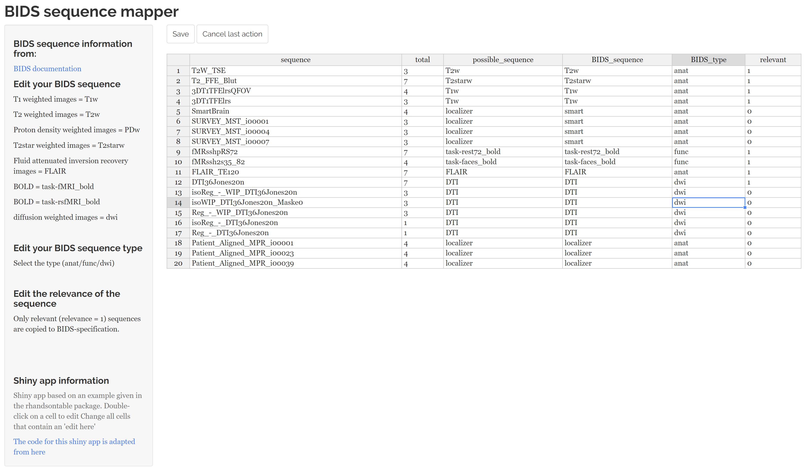
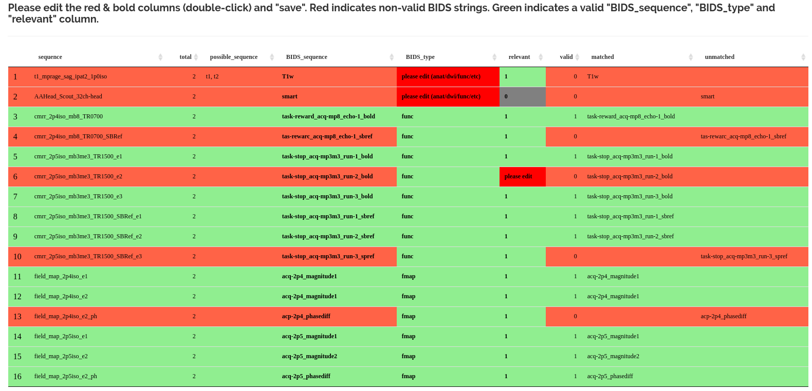
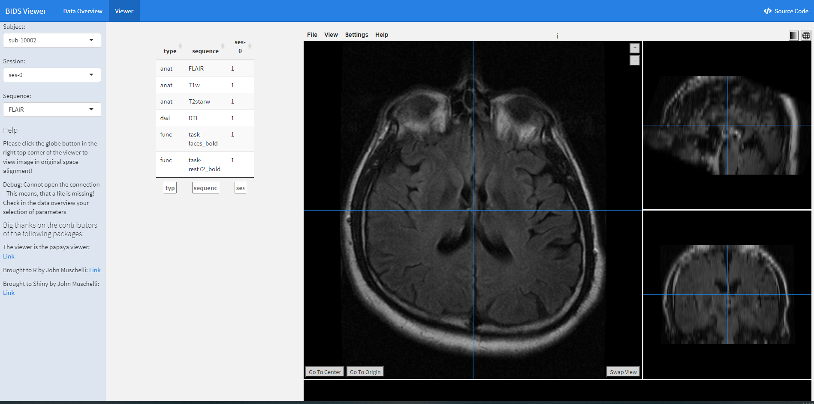

<!-- README.md is generated from README.Rmd. Please edit that file -->

```{r, include = FALSE}
knitr::opts_chunk$set(
  collapse = TRUE,
  comment = "#>",
  fig.path = "man/figures/README-",
  out.width = "100%",
  eval = FALSE
)
```

# BIDSconvertR <a href='https://pkg.mitchelloharawild.com/icon'></a>

<!-- badges: start -->

[](https://zenodo.org/badge/latestdoi/195199025)

```{r, include = FALSE}
hexSticker::sticker("inst/figure/mri.png", package = "BIDSconvertR", 
                    p_size = 18, s_x = 1, s_y = .75, s_width =.5, 
                    h_color = "blue", h_fill = "darkgreen", 
                    filename = "inst/figure/BIDSconvertR.png")
```

The hexagonal sticker is based on the MRI svg graphics provided by Flaticon and was created by mavadee [Flaticon Link](https://www.flaticon.com/free-icons/mri).

<!-- badges: end -->

The goal of BIDSconvertR is to provide a workflow, which is able to:

-   convert DICOM data to NIfTI data using [dcm2niix](https://github.com/rordenlab/dcm2niix)
-   structure this data according to the [BIDS specification](https://bids-specification.readthedocs.io/en/stable/)
    -   validate the sequence-ID's
    -   enable easy access to the [BIDS-Validator](https://bids-standard.github.io/bids-validator/) (Website/Docker)
-   provide the [papayaWidget](https://github.com/muschellij2/papayaWidget) viewer for inspecting the images
-   enable continuous application during data acquisition in ongoing studies

### Features

Renaming of unclean subject-ID's or session-ID's.

Everytime new files or sequences are added, the 'sequence mapper' opens again until everything is declared according to BIDS.
Already processed files are skipped.

## Installation of R

##### Windows

download a recent [R version](https://cran.r-project.org/bin/windows/base/)

If you work on Windows just download [Rtools](https://cran.r-project.org/bin/windows/Rtools/) according to your R-version and install it.
It is required to install the packages.

Install [RStudio](https://www.rstudio.com/products/rstudio/download/#download)

##### Linux

```{bash}
wget -qO- https://cloud.r-project.org/bin/linux/ubuntu/marutter_pubkey.asc | sudo gpg --dearmor -o /usr/share/keyrings/r-project.gpg


echo "deb [signed-by=/usr/share/keyrings/r-project.gpg] https://cloud.r-project.org/bin/linux/ubuntu jammy-cran40/" | sudo tee -a /etc/apt/sources.list.d/r-project.list

sudo apt update

sudo apt install --no-install-recommends r-base

sudo apt install r-base-dev

sudo apt install libcurl4-openssl-dev libssl-dev libxml2-dev libfontconfig1-dev
```

Install [RStudio](https://www.rstudio.com/products/rstudio/download/#download)

"Right-Click -> Open With ->Software Install" should help in installing it.


#### Inside R

You need to install the R package 'devtools' once, which is required to install packages from Github.

```{r}
install.packages("devtools")
```

Now you are able to install the most recent development version of 'BIDSconvertR'.

```{r}
devtools::install_github(repo = "wulms/bidsconvertr")
```

## Usage

### Input data

The input data needs to be in the following structure:

-   an input folder containing all folders with DICOM data

    -   .../subjects/sessions/DICOM
        -   one folder per subject, e.g. "00001", "00002"
        -   these folders containing the session data, each of them containing the DICOM data
    -   .../sessions/subjects/DICOM
        -   cross-sectional (one folder named 'baseline' or else)
        -   one folder per session, e.g. "session_1", "session_2"
        -   these folders containing the DICOM data in separate folders per subject, e.g. "001", "002"

### Starting the tool

```{r}
library(bidsconvertr, quietly = TRUE) # loads the library, the 'quietly' argument turns off the messages about loading other dependencies.
convert_to_BIDS() # function that starts the workflow
```

### User dialog

A user dialog starts, which creates a 'user_settings.R' file based on your inputs.
This file stores your settings and variables.

##### Do you have a user settings file?

+----------+---------------------------------------------------------------------------------------------------------------------+
| Option   | What happens?                                                                                                       |
+==========+=====================================================================================================================+
| Yes      | You are able to select your already existing file. The the user dialog is skipped. Starts the rest of the workflow. |
+----------+---------------------------------------------------------------------------------------------------------------------+
| No       | Creates your user settings file (described below).                                                                  |
+----------+---------------------------------------------------------------------------------------------------------------------+

: User options

##### Please select the root directory of all DICOM images (your input folder, as described above.)

You select the root folder, that contains all session/subject or subject/session folders.
If you only have one session, store your data in a e.g. 'session-0' folder.

The terminal shows a list of folders.
These should contain the DICOM data.

##### Do these folders contain the DICOM images?

| Option to select | What happens?                           |
|------------------|-----------------------------------------|
| Yes              | next step                               |
| No               | You are able to select the folder again |

: User options

##### Is your DICOM data structured as 'session/subject' or 'subject/session'.

The tool extracts extracts the subject- and session-ID's based on these order.
The terminal shows the folders.

Please note: Any subject- or session-ID's are possible!
Also without "sub-" or "ses-".

| Folder order of your files | Selection       |
|----------------------------|-----------------|
| sub-0001/ses-01            | subject/session |
| ses-01/sub-0001            | session/subject |

: Example of folder orders

Select the option according to your data.

##### Were subject-ID's and session-ID's extracted the right way?

The terminal shows a table with a "subject" and a "session" column.

| Option to select | What happens?                  |
|------------------|--------------------------------|
| Yes              | Next step is started.          |
| No               | Change the folder order again. |

##### Selection of output directory.

You are able to select any folder on your disk.
So you are able to store raw data at another location than converted data.

### User dialog - part II (subject- and session-ID's, optional): 

This part is about cleaning or extraction of subject-ID's and renaming of sessions.

You are asked, if your subject- and session-ID's are fine, or if you want to edit them.
If your data was already acquired with clear subject- and session-ID's you can skip this procedure by selecting:

+-------------------------------+-------------------------------------------------------------------------------------------------------------+
| Option to select              | What happens?                                                                                               |
+===============================+=============================================================================================================+
| No, my subject-ID's are fine. | The paths are created, subject- and session-ID's get a "sub-" and "ses-" prefix, if it isn't already there. |
+-------------------------------+-------------------------------------------------------------------------------------------------------------+
| Yes                           | 1)  set a subject-ID regular expression                                                                     |
|                               |                                                                                                             |
|                               | 2)  set a string, prefix, suffix or regular expression, which is then removed from each subject-ID.         |
+-------------------------------+-------------------------------------------------------------------------------------------------------------+

#### Useful regular expressions

+------------------------------+--------------------------------+-----------------------------------------------+-------------------+
| subject-ID (from foldername) | regular expression             | described in words                            | output subject-ID |
+==============================+================================+===============================================+===================+
| 01234                        | [:digit:]{5}                   | 5 digits                                      | sub-01234         |
+------------------------------+--------------------------------+-----------------------------------------------+-------------------+
| Control2132                  | (Control\|Patient)[:digit:]{4} | "Control" OR "Patient" followed by 4 digits   | sub-Control2132   |
|                              |                                |                                               |                   |
| Patient0123                  |                                |                                               | sub-Patient0213   |
+------------------------------+--------------------------------+-----------------------------------------------+-------------------+
| abcd0123                     | [:alpha:]{4}[:digit:]{4}       | 4 letters and 4 digits                        | sub-abcd0123      |
|                              |                                |                                               |                   |
| sdfjd3222                    |                                |                                               | sub-sdfjd3222     |
+------------------------------+--------------------------------+-----------------------------------------------+-------------------+
| adc932d                      | [:alnum:]{5,7}                 | between 5 to 7 alphanumeric (letters, digits) | sub-adc932d       |
|                              |                                |                                               |                   |
| 23d49                        |                                |                                               | sub-23d49         |
+------------------------------+--------------------------------+-----------------------------------------------+-------------------+

: Examples of subject-ID regular expressions

+------------------------------+---------------------------------+------------------------------------------------------+-------------------+
| subject-ID (from foldername) | regular expression              | described in words                                   | output subject-ID |
+==============================+=================================+======================================================+===================+
| 02313_bidirect               | \_(bidirect\|BiDirect\|Bidiect) | "\_" followed by "bidirect", "BiDirect" or "BiDiect" | sub-02313         |
|                              |                                 |                                                      |                   |
| 03211_BiDirect               |                                 |                                                      | sub-03211         |
|                              |                                 |                                                      |                   |
| 02111_Bidiect                |                                 |                                                      | sub-02111         |
+------------------------------+---------------------------------+------------------------------------------------------+-------------------+
| test0111                     | test\|study_a\_                 | "test" or "study_a\_"                                | sub-0111          |
|                              |                                 |                                                      |                   |
| study_a\_1111                |                                 |                                                      | sub-1111          |
+------------------------------+---------------------------------+------------------------------------------------------+-------------------+
| pre9222post                  | pre\|post\|suffix\|prefix       | as in the cell above                                 | sub-9222          |
|                              |                                 |                                                      |                   |
| suffix223prefix              |                                 |                                                      | sub-223           |
+------------------------------+---------------------------------+------------------------------------------------------+-------------------+

: Examples of 'patterns to remove' regular expressions

For more information on regular expressions (regex) please see the [stringR cheat sheet](https://github.com/rstudio/cheatsheets/blob/main/strings.pdf) or[RegexOne](https://regexone.com/).
Each regex set here should match to your data.
If you encounter any problems just contact me via mail or via the issues in this repository.

These both functions should give you enough flexibility to clean up your filenames and modify your regular expression step by step.

You are now able to edit your session-ID's.
You decide, if you want to keep or rename them.

##### Do you want to edit your session-ID's?

+-------------------------------+-------------------------------------------------------------------------+
| Option to select              | What happens?                                                           |
+===============================+=========================================================================+
| Yes, I need to change them    | Each session is opened separately and you can enter the new session-ID. |
+-------------------------------+-------------------------------------------------------------------------+
| No, my session-ID's are fine. | Nothing is edited, you keep your session-IDs                            |
+-------------------------------+-------------------------------------------------------------------------+

Yes:

| session-ID (old) | session-ID (user input) | session-BIDS |
|------------------|-------------------------|--------------|
| baseline         | 1                       | ses-1        |
| follow_up        | 2                       | ses-2        |

: "Yes, I need to change them" can result in output like this. The user could also choose to use "followup" or something else.

No:

| session-ID (old) | session-BIDS  |
|------------------|---------------|
| baseline         | ses-baseline  |
| follow_up        | ses-follow_up |

: "No, my session-ID's are fine"

### Selection for your 'user settings' file.

You select a folder, where the file is stored.
This can be anywhere on your filesystem.
This is the file, that you can edit to start the workflow again without setting up all the information.

# Start of the workflow

Based on the inputs your data is converted via dcm2niix into NifTI format.

All JSON headers are read out and merged together.

The unique sequence-ID's are extracted and the Sequence Mapper is launched.

The Sequence Mapper is a Shiny App, which should enable you to rename your sequences according to the BIDS specification.
You can edit a cell after a double-click on it.

Now the 'sequence_mapper' should start showing the following interface:

{alt="Sequence Mapper"}

You have to edit each entry according to the BIDS specification.
Some tips can be found on the left panel and hyperlinks to the BIDS specification.
Then you click "save" and close the 'sequence mapper'.

1)  You need to edit each cell, that contains a "please edit".

2)  Each 'BIDS_sequence' and 'BIDS_type' entry is validated in the backend with regular expressions based on BIDS.
    If a row is coloured "green" you have a high chance of a valid BIDS output.

3)  But note, we do not limit you in naming files.
    You are able to save non-valid BIDS strings, which are copied to BIDS, if selected as relevant.

4)  You can ignore red rows, when having "irrelevant" marked cells.
    These are not exported to BIDS.
    Still, you have to remove the "please edit" from them.
    This is mandatory, so that the algorithm knows, that the user has edited each cell.

5)  Please "save" your table and close the app.
    The closing starts the rest of the workflow.



The 'matched' column shows, when a sequence was detected as BIDS compliant.
If your sequence is in the 'unmatched' column investigate each letter of the filename.

If everything is fine:

1. The files are copied to BIDS.

2. The BIDS validation is started.
Via Docker, if it is installed on your local machine, otherwise the online-version is launched and you have to select your folder manually.

3. You are asked, if you want to delete temporary images from your hard drive.
Don't do this manually!
Do this only, when you have validated your data, and you already acquired all your data.

4. A Shiny viewer is started to visually inspect the images.

{alt="BIDS viewer"}

# More information

#### What is in my 'user_settings.R' file?

You can also edit the file "user_settings.R" manually to your needs.

+----------------------+------------------------------------------------------------------------------------------------------------------------+-------------------------------------------------------------------------------------------------------------------------------------------------+
| Variable             | Example                                                                                                                | Description                                                                                                                                     |
+======================+========================================================================================================================+=================================================================================================================================================+
| path_input_dicom     | "/media/niklas/BIDS_data/dicom/"                                                                                       | Input path, where your DICOM folders are inside of session folders                                                                              |
+----------------------+------------------------------------------------------------------------------------------------------------------------+-------------------------------------------------------------------------------------------------------------------------------------------------+
| path_output          | "/media/niklas/BIDS_data/BIDSconvertR"                                                                                 | A path, where all the output of the converter should be written to.                                                                             |
+----------------------+------------------------------------------------------------------------------------------------------------------------+-------------------------------------------------------------------------------------------------------------------------------------------------+
| study_name           | "BiDirect Study"                                                                                                       | Your study name, only needed for the dashboard rendering.                                                                                       |
+----------------------+------------------------------------------------------------------------------------------------------------------------+-------------------------------------------------------------------------------------------------------------------------------------------------+
| regex_subject_id     | "[:digit:]{5}"                                                                                                         | Regex defining your unique subject ID's.                                                                                                        |
+----------------------+------------------------------------------------------------------------------------------------------------------------+-------------------------------------------------------------------------------------------------------------------------------------------------+
| regex_group_id       | "[:digit:]{1}(?=[:digit:]{4})"                                                                                         | Regex defining the group ID (if present).                                                                                                       |
+----------------------+------------------------------------------------------------------------------------------------------------------------+-------------------------------------------------------------------------------------------------------------------------------------------------+
| regex_remove_pattern | "[:punct:]{1}\|[:blank:]{1}\|((b\|d)i(d\|b)i\|bid\|bd\|bdi)(ect\|rect)(\$\|(rs\|T2TSE\|inclDIRSequenz\|neu\|abbruch))" | These regex will be removed from the file names.                                                                                                |
+----------------------+------------------------------------------------------------------------------------------------------------------------+-------------------------------------------------------------------------------------------------------------------------------------------------+
| sessions_id_old      | c("Baseline", "FollowUp", "FollowUp2", "FollowUp3")                                                                    | The folder (and session) names before conversion                                                                                                |
+----------------------+------------------------------------------------------------------------------------------------------------------------+-------------------------------------------------------------------------------------------------------------------------------------------------+
| sessions_id_new      | c("0", "2", "4", "6")                                                                                                  | The folder (and session) names after conversion. These can be identical to "sessions_id_old". But note, that in BIDS a number is the way to go. |
+----------------------+------------------------------------------------------------------------------------------------------------------------+-------------------------------------------------------------------------------------------------------------------------------------------------+
| mri_sequences        | "T1\|T2\|DTI\|fmr\|rest\|rs\|func\|FLAIR\|smartbrain\|survey\|smart\|ffe\|tse"                                         | These are regular expressions, which should be matched to your MRI sequence ID's.                                                               |
+----------------------+------------------------------------------------------------------------------------------------------------------------+-------------------------------------------------------------------------------------------------------------------------------------------------+

: Table 1: Information in the user settings file

#### dcm2niix: installation of other versions

The "convert_to_BIDS()" function automatically uses the tested "v1.0.20211006" of dcm2niix.
Other versions can be installed by changing the version number and running the script before running "convert_to_BIDS()" the first time.

Otherwise go to your output folder, delete the dcm2niix files in it, and run the "install_dcm2niix()" version with your version number.

<https://github.com/rordenlab/dcm2niix/releases>

```{r}
install_dcm2niix("v1.0.20181125") # if you want to install the specific version v1.0.20181125
```

## Citation

[@wulms2022]
